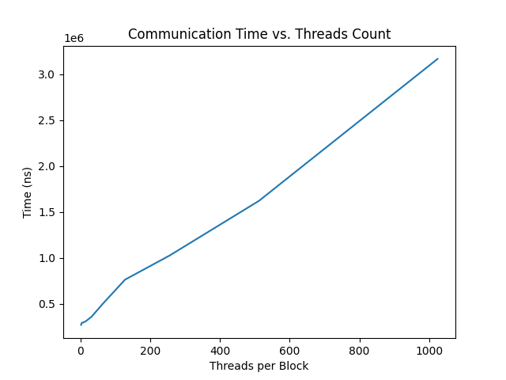
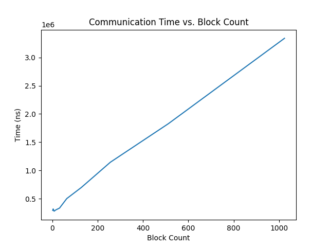
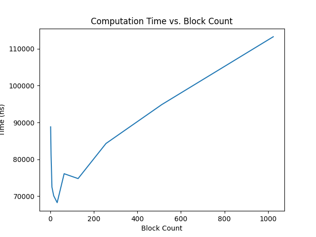
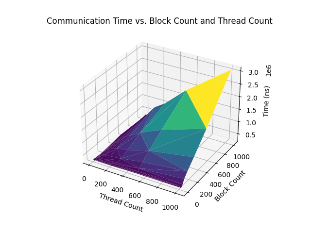
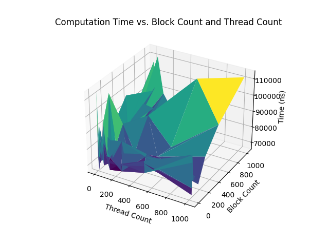
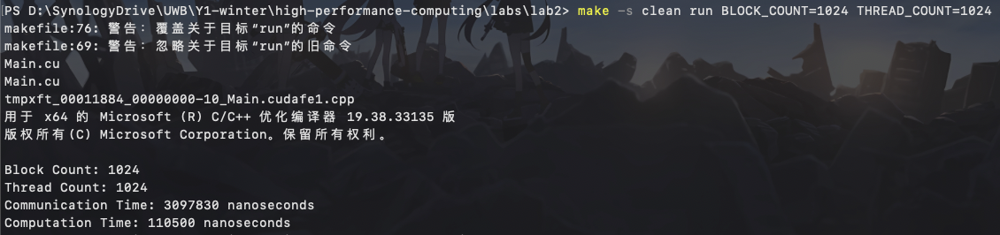

# Spec

GPU: 

* Model: 2080 Super
* Architecture: Turing 
* CUDA Cores: 3072
* Base Clock Speed: 1.65GHz
* Memory: 8 GB GDDR6 256-bit
* CUDA Capability: 7.5
* CUDA Version: V12.6.77

System: 

* Windows 10.0.22621.2506
* Compiler: cl 19.38.33135, nvcc

Source: https://www.nvidia.com/en-us/geforce/graphics-cards/compare/?section=compare-20

# Steps

* The project is organized using a Makefile. It use `nvcc` and `cl` to compile `.cu` file and `c++` file accordingly to `.obj` file, then link them with `cl` 

* Two header files `Array.hpp` and `CPUVectorSum.hpp` are placed in the `include` folder, which contains a custom Array class with some helper functions and the CPU version of vector sum 

* The main function and the GPU implementation are in the `src/Main.cu` file. 

* Each time the program is compiled and launched, it runs one certain configuration 10 times and measure both the average communication time and computation time. It also check whether the GPU results are correct by comparing it with the sequential CPU results. If the comparison fails, an error will be thrown. 

* To compile the program, use the following command, which require GNUWin32 `make` installed 

  ```sh
  make clean build BLOCK_COUNT=<block_count> THREAD_COUNT=<thread_count>
  # replace <block_count> and <thread_count> with actual number
  ```

  After the compilation, the executable will be at `bin/program.exe`

  If you done have `make` install, you can also use the alternative command

  ```sh
  nvcc -Iinclude .\src\Main.cu -DDBLOCK_COUNT=<block_count> -DTHREAD_COUNT=<thread_count>
  # replace <block_count> and <thread_count> with actual number
  ```

  In this case, the program will be a `./a.exe`

* To automate the process of running multiple configurations, 3 batch files are included. Details of each corresponding configurations can be found in the next section. 

  * `repeat_block.bat`: configuration 2
  * `repeat_thread.bat`: configuration 1
  * `repeat.bat`: configuration 3

  The output will be 3 json files 

* To plot the result from the output json files, run the python script `plot.py`. Make sure you have `python` and `matplotlib.pyplot` installed 

  ```sh
  python plot.py
  ```

  The output will be 6 different png images, which is also presented in the next section.

# Execution Configurations

| Id   | Description                                           | Block Count (2^) | Thread Count (2^) |
| ---- | ----------------------------------------------------- | ---------------- | ----------------- |
| 1    | Fix Block Count to 2^10, change Thread Count          | 10               | 1 - 10            |
| 2    | Fix Thread Count to 2^10, change Block Count          | 1 - 10           | 10                |
| 3    | Change both Thread Count and Block Count              | 1 - 10           | 1 - 10            |
| 4    | Corner Case - Over 1024 Threads per Block             | 1                | 11                |
| 5    | Corner Case - Both Block Count and Thread Count are 1 | 1                | 1                 |

### Results

| Id   | Communication Time                                           | Computation Time                                          |
| ---- | ------------------------------------------------------------ | --------------------------------------------------------- |
| 1    |  |  |
| 2    |   |    |
| 3    |               |                |

| Id   | Result Description                                           |
| ---- | ------------------------------------------------------------ |
| 4    | The code can be compile and run, but the resulting vector is not correct (all 0, not the same as the CPU Sequential one) |
| 5    | Nothing special, the same as processing an array with only one element. However, if the actual vector is longer than 1, the remaining elements will not be processed, leading to a wrong result. To provide a correct result, we have to keep invoking the kernel $N$ times (for vector of size $N$). Then it is basically the same as the sequential CPU implementation, but even slower because GPU cores are slower than CPU cores. |

### Screenshots

|    |  |
| ---------------------------------------- | -------------------------------------- |
| Block Count: 1024<br />Thread Count 1024 | Block Count: 1<br />Thread Count: 2048 |

